# Logging and Run Visibility for Python in Snowflake

Productionalization of data pipelines is a very important aspect of any successful data engineering project. It is not enough to build clean, scalable data pipelines - they should also be built in a way that makes future development easy, enables troubleshooting, and provides good visibility once a feature goes to production.

While SQL stays as the base of business logic implementation, Python is useful for workloads where logic is easier to express in code, e.g. dynamic query generation, config-driven transformations, external API calls, etc. The challenge with Python compared to SQL is that SQL queries run on a warehouse and are automatically tracked in query history, while Python runs are not. Depending on how you deploy Python, a pipeline run leaves traces in different places, with different levels of detail and different access controls.

This article covers three options for running Python in Snowflake and compares them for the ease of deployment, logging, and run visibility: **stored procedures**, **notebooks**, and **Snowflake ML jobs**. 

We are using the same simple pipeline to illustrate each option.

**Table of Contents**

- [Implemented Scenario](#implemented-scenario)
- [Option 1: Stored Procedures](#option-1-stored-procedures)
- [Option 2: Notebooks](#option-2-notebooks)
- [Option 3: Snowflake ML Jobs](#option-3-snowflake-ml-jobs)
- [Comparison](#comparison)

## Implemented Scenario

All three examples are using the same workload: a minimal **SCD Type 1 merge** where Python builds a `MERGE` statement from a config dictionary and executes it. The point is to have something realistic enough to generate meaningful logs and run history, while simulating a data engineering workload that does not require a large cluster for Python executions.

A link to the source code is provided at the end of this article, or this article can also be read in the [source repository](https://github.com/T1A/snowflake-py-logs-walkthrough/blob/main/article.md).

## Option 1: Stored Procedures

One of the options for running Python code in Snowflake is a stored procedure. A Python stored procedure handler is a regular Python function that receives a Snowpark `Session` as its first argument. From there, Snowpark provides a way to interact with Snowflake tables, and the queries are pushed down to be executed inside a Snowflake warehouse. The handler can be written inline (as text) in the `CREATE PROCEDURE` body (convenient for short scripts but not convenient for interactive development) or kept in a `.py` file on an internal stage. Stored procedures support parameters compatible with SQL data types that should be matched by the handler function.

### Run visibility

#### Query History

Every procedure `CALL` is a SQL query, so it lands in Query History automatically and includes basic information about the procedure call itself. The pushed-down queries initiated from Python procedure code (for example, via `Session.sql`) also appear in Query History. Other parts of the Python code execution, unfortunately, cannot be tracked as easily.

In this example, we are using a stored procedure `PY_LOGS_DEMO.PUBLIC.SCD1_MERGE` that prepares DDL, generates source data, and loads it to an SCD1 target table. Information about the SQL-related parts (procedure call, pushed-down queries) appears in Query History:

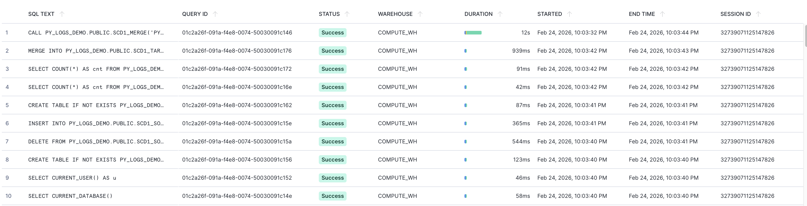

#### Python Logger

The traceability of Python code can be increased with the Python `logging` package. To capture structured in-run log messages, an **event table** can be created (once) and attached to the database where the procedure lives. Alternatively, the global default event table can be used. Log capture must be enabled per procedure:

```sql
CREATE EVENT TABLE PY_LOGS_DEMO.PUBLIC.EVENTS;
ALTER DATABASE PY_LOGS_DEMO SET EVENT_TABLE = PY_LOGS_DEMO.PUBLIC.EVENTS;
ALTER PROCEDURE PY_LOGS_DEMO.PUBLIC.SCD1_MERGE(...) SET LOG_LEVEL = 'INFO';
```

Standard Python `logging` then routes to the event table:

```python
logger = logging.getLogger("scd1_proc")
...
logger.info(f"Source table {src_table} has {src_count} rows")
```

Python logs from the procedure call can be viewed in the event table (`SCOPE` column includes the logger name). A query to this event table will, among other things, show the following data for the `PY_LOGS_DEMO.PUBLIC.SCD1_MERGE` call:

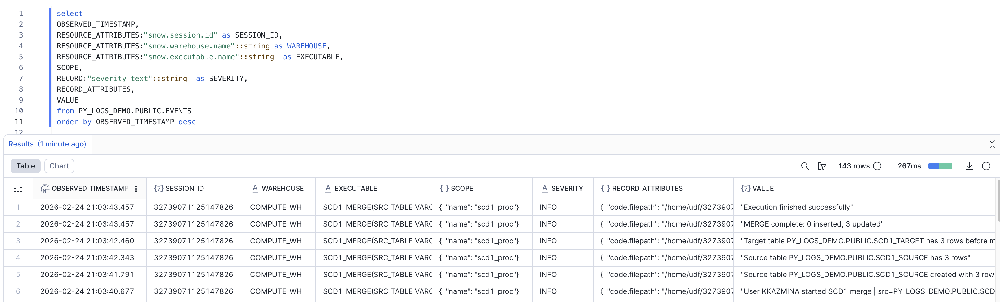

All the information from log messages can only be seen in the event table and does not appear in Query History.

Note that log entries appear in the event table with a small delay, and enabling log capture results in additional storage costs.

### Error handling

**SQL errors** surface in Query History automatically. For example, this can be triggered by a positional `INSERT` query failing with a column count mismatch.

The procedure `CALL` and the failing `INSERT` both appear in Query History with `Failed` status:

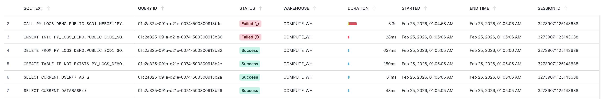

The error from the procedure `CALL` in Query History is cut off at a certain length, is not configurable, and is not user-friendly (although it will include the custom Python exception text when provided):

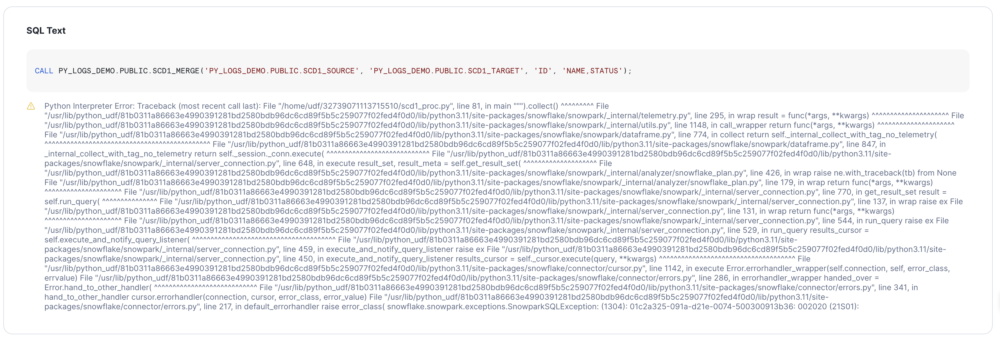

The failed `INSERT` shows the readable SQL and error message in Query History:

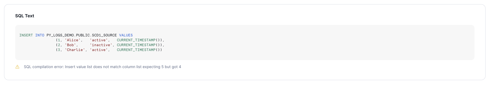

**Python exceptions** are not logged automatically. With the catch, log with traceback, and re-raise pattern the error lands in the event table with proper context and configurable error message. So when this code is used inside the procedure:

```python
try:
    ...
    # perform SCD1 load
    ...
except Exception as e:
    logger.error(f"SCD1 merge failed for {tgt_table}: {e}\n{traceback.format_exc(1)}")
    raise e
```

The event table contains the error entry with the respective traceback:

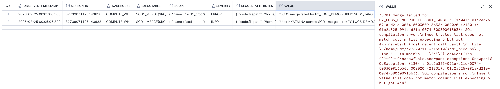

The custom error handling becomes more useful for **Python errors** that are not represented by a failure of an underlying SQL query. In addition to the error message, the `extra` keyword argument can be used to set key-value pairs that are written to a queryable field in the `RECORD_ATTRIBUTES` column of the event table, which can improve subsequent log analysis.

The following code provides a dictionary in the `extra` argument:

```python
if missing_key_cols:
    ...
    logger.error(
        msg,
        extra = {'error_type': 'INVALID_SCD1_KEY', 'input_cols': key_cols, 'invalid_cols': missing_key_cols}
    )
    raise ValueError(msg)
```

Which can then be seen in the event table:

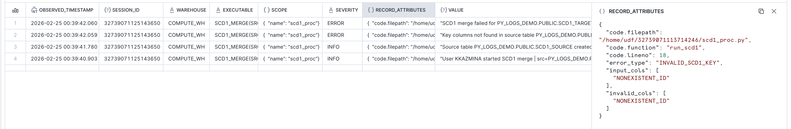

In addition to access via SQL query, an event table can also be accessed from the Snowflake UI (Traces & Logs tab in Monitoring). This view provides easy-to-use filters and visualization of aggregate event statistics.


### Summary

**Pros:**
- Run traceability at the level of SQL queries: every `CALL` and every pushed-down query is in Query History with no extra setup
- The workload can be triggered via SQL
- Can reuse existing warehouse compute and does not require additional compute infrastructure
- Possible to capture structured, queryable logs via Python's standard `logging` package

**Cons:**
- Interactive development is complicated: every code change requires uploading the file to stage and redeploying. When the procedure has an inline body, the code is represented as text with no syntax highlighting.
- No dedicated UI that can show info / debug messages
- Log entries appear in the event table with a small delay
- Enabling log capture adds costs for Snowflake-managed resources
- Non-SQL, Python-type parameters are not natively supported in procedure signatures

## Option 2: Notebooks

Snowflake Notebooks are mixed SQL and Python cells that can be run on warehouse compute or in a container on a dedicated compute pool. Notebooks are well suited for interactive development. The same notebook can also be deployed to run non-interactively, including run initiation from SQL via `EXECUTE NOTEBOOK`.

As with procedures, the code can be stored in the `.ipynb` file on an internal stage, and a notebook object can be created from this file.

Parameters can be passed as string arguments to `EXECUTE NOTEBOOK`. They are declared as text input widgets inside the notebook and accessed as variables, thus the type support is limited and the pattern is less convenient than procedure signatures.

### Run visibility

#### Query History

`EXECUTE NOTEBOOK` is a SQL statement and appears in Query History like any other query. For notebooks triggered this way, run status and duration are trackable at that level. The pushed-down SQL queries also appear separately in Query History.

#### Notebooks UI

For the more details on the runs Snowflake provides the run history view in the notebooks UI. While the notebook cell output, errors and general run information is indeed accessible from this UI, cell output is retrieved from internal cache and is not reliable: there might be runs where the cell output cannot be retrieved.  
But the bigger issue here is that each user only sees their own runs, whether they were triggered from `EXECUTE NOTEBOOK` or manually through UI.

#### Python Logger

 The following description is based on the [Snowflake documentation on Notebook Observability](https://docs.snowflake.com/en/user-guide/ui-snowsight/notebooks-in-workspaces/notebooks-in-workspaces-observability-logging) and hands-on experiments, but the described behaviour might change with time. 
 
 The Python `logging` approach can increase run visibility, similar to Option 1, but there are some nuances.

First difference is that the notebook run telemetry can be captured in event table, but it relies on the telemetry for the container that runs it. This means that _"Run on container"_ option should be selected for notebook runtime instead of the _"Run on warehouse"_. 

In addition to that, there appears to be no mechanism to redirect this telemetry to a specified event table, and the default table `SNOWFLAKE.TELEMETRY.EVENTS` will be used. This includes the case when the notebook is defined in a database that has a custom event table: Python logs from this notebook will still appear in the default table.

It is also difficult to overwrite the log level, which is WARNING by default: the `logging.getLogger().setLevel(logging.INFO)` works normally for root logger, but everything below the WARNING level appears to be suppressed when trying to use a child-level logger instead of root-level logger (e.g. `logger = logging.getLogger('scd1_notebook').setLevel(logging.INFO)`). And this root log level setting needs to be repeated in every notebook cell as Snowflake appears to inject a fresh logging handler into the root logger at the start of each cell execution.


This article uses a notebook named `PY_LOGS_DEMO.PUBLIC.SCD1_NOTEBOOK` that runs on compute pool `PY_LOGS_DEMO_POOL`. The following custom log messages are included at the start of the workload:
```py
logging.getLogger().setLevel(logging.INFO)
...
logging.info(
    f'User {current_user} started SCD1 merge | '
    f'src={src_table} tgt={tgt_table} | '
    f'key_cols={key_cols} tracked_cols={tracked_cols}'
)
logging.warning('This is how warning looks')
```

Python logs from the notebook runs can be viewed in the event table together with other logs for this compute pool. This is an example of traced data for a successful run:

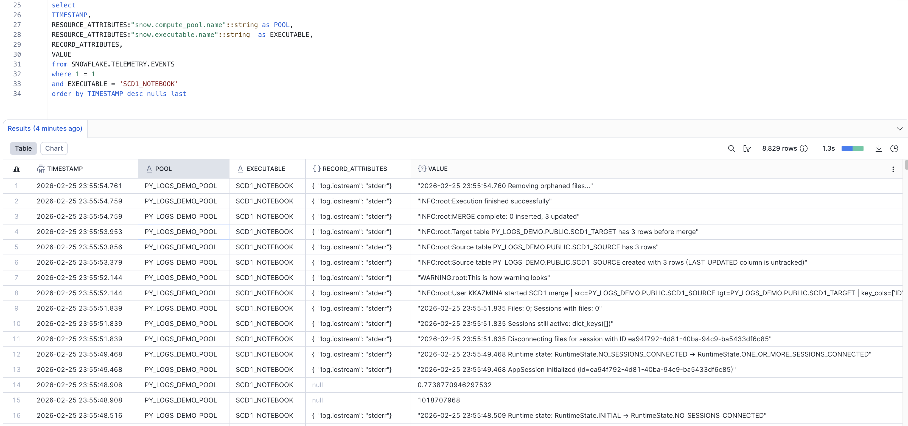


### Error handling

When run interactively in Snowsight, a cell error is visible inline with the full traceback.

The queries look similar to Option 1 in Query History: pushed-down SQL queries appear separately (with readable errors if any), while the `EXECUTE NOTEBOOK` command (for non-interactive runs) also appears in the Query History and can have unstructured, non-configurable Python error message with traceback.

The event table for failed notebook runs with custom Python logging looks less clean compared to Option 1 and appears to not allow multiline messages, but the error is still visible:

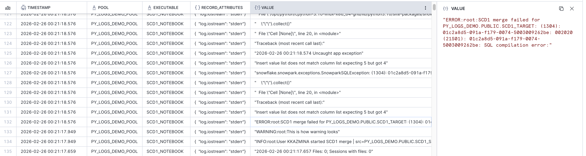

### Summary

**Pros:**
- Easiest interactive development experience: cell-by-cell execution, inline errors, UI integration (including some support for run traceability)
- Run traceability at the level of SQL queries: `EXECUTE NOTEBOOK` and pushed-down SQL queries appear in Query History with no extra setup
- The workload can be triggered via SQL
- Possible to capture structured logs via Python's standard `logging` package (but involves some challenges) when using non-warehouse runtime compute 

**Cons:**
- Run history in the notebooks UI is owner-scoped: each user only sees their own runs
- Log entries appear in the event table with a small delay
- Enabling log capture adds costs for Snowflake-managed resources
- Log capture requires container runtime (not warehouse)
- Log capture has configuration limitations (global event table used, no child loggers, etc)
- Parameters are limited to strings and passed as positional arguments to `EXECUTE NOTEBOOK`, which is less convenient than procedure signatures

## Option 3: Snowflake ML Jobs

This option is called **ML Jobs** in Snowflake, but the name is broader than it sounds. The Snowflake team confirmed that using them for general Python workloads and not just ML is a supported use case. In the monitoring UI they appear simply as **Jobs**, and the API (`snowflake.ml.jobs`) doesn't expose any ML-specific functions. Moreover, this option runs on **compute pools** but does not automatically involve large ML-optimized compute, and the overall costs will likely be lower than the costs for SQL-first services, despite the ML connotation suggesting otherwise.

The deployment pattern is different from the previous two options. A job is represented by a normal Python function written locally and decorated with `@remote` from `snowflake.ml.jobs`. When the decorated function is called, the decorator packages and submits it to Snowflake as a container job on a compute pool, returning a **job handle** that can be used to monitor the run. Alternatively, a local `.py` file or a `.py` file from Snowflake internal stage can be submitted with `submit_file()` or `submit_from_stage()`. There is a way to create job run from Snowflake UI, but it requires some additional setup. 

Function arguments pass naturally as regular Python arguments, no SQL type restrictions apply. There is no SQL-level trigger equivalent to `CALL` or `EXECUTE NOTEBOOK`, jobs are submitted from the Python SDK only. Although it is possible to wrap it in another SQL-triggerable object (for example, Snowflake notebook), so the option to trigger an ML job from SQL still exists.

This article uses a job `SCD1_MERGE` locally submitted via the `@remote` decorator to compute pool `PY_LOGS_DEMO_POOL`. The job prepares DDL, generates source data, and loads it to an SCD1 target table, same as the stored procedure and notebook examples.

### Run visibility

#### Query History

Similar to Options 1 and 2, all pushed-down SQL queries appear in Query History with no extra setup. In addition to them, all the service-level queries from the ML job will also be shown there (e.g. loading a file with executed code to an internal stage).

#### Job Status and Logs API

Every submitted job gets a unique ID. The status and full console output are available from the job handle. The `get_logs()` method captures everything that would appear in a container's console: `print()` output, Python `logging` messages, tracebacks. Unlike the event table approach in Options 1 and 2, this is a direct retrieval of the run's console output with no additional setup and no delay. Note that, based on experiments, `get_logs()` only returns the `stdout` stream content after the job is finished successfully (TODO: check if true for err as well).

Past jobs can also be listed and retrieved programmatically with `list_jobs()`.

#### Job Monitoring UI

Submitted jobs appear in UI under the **Monitoring - Jobs** section. This view shows general run info for each job and has some extra views with more details. For a running job the container's console output is available live as streaming text. After the job completes the same logs are accessible from the historical view and also appear in the default event table (`SNOWFLAKE.TELEMETRY.EVENTS`), similar to notebooks running on a compute pool. As with Option 2, there appears to be no mechanism to redirect logs to a custom event table.

#### Python Logger

Standard Python `logging` works inside the remote function as it would in any Python script. Since `get_logs()` captures the full console, custom `logging` output will also be retrieved. Based on experiments, by default the ML job logger writes all messages to `stderr`, so to get more details via `get_logs()` after the job finishes the stream should be reconfigured:

```python
logging.basicConfig(
    level=logging.INFO, 
    format='%(levelname)s %(name)s: %(message)s', stream=sys.stdout, 
    force=True
)
logger = logging.getLogger('scd1_job')
...
logger.info(
    f'User {current_user} started SCD1 merge | '
    f'src={src_table} tgt={tgt_table} | '
    f'key_cols={key_cols} tracked_cols={tracked_cols}'
    )
logger.warning('This is how warning looks')
```

This is how custom logs appear in Job Monitoring UI (live logs during run):
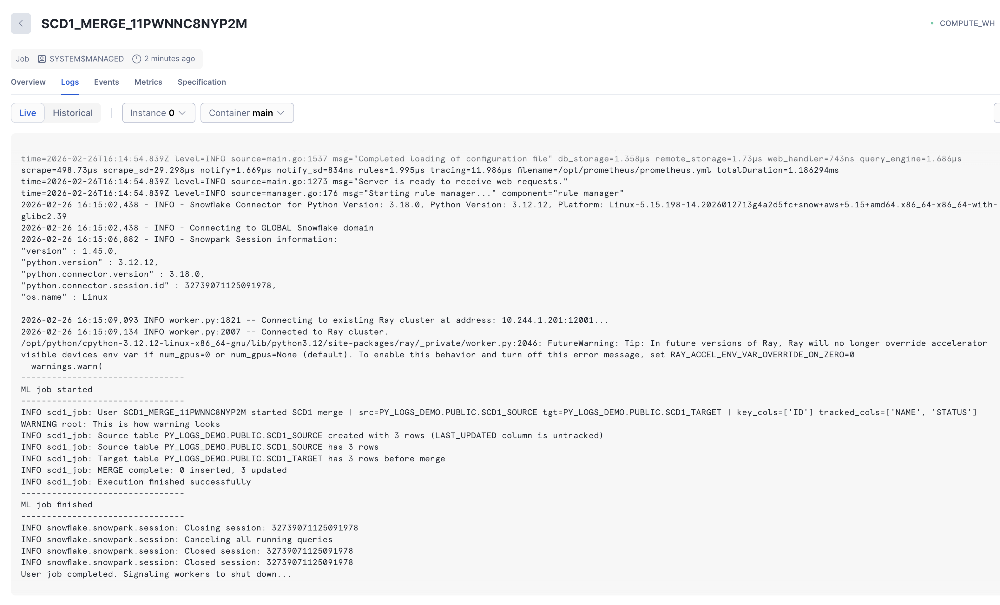

Custom log data is captured in the default event table together with the rest of output produces by container run.

### Error handling

Pushed-down SQL queries appear separately (with readable errors if any), similar to Options 1 and 2.

When a job fails, the status changes to `FAILED`. Job runs with respective statuses are visible in Job Monitoring UI:
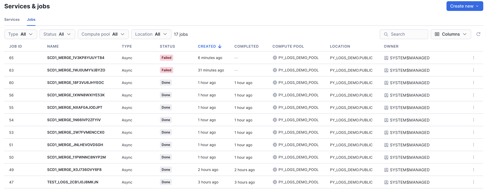

The full traceback is captured in the console output: `job.get_logs()` returns the complete error output including the traceback. Errors are also shown in the Job Monitoring UI and in the event table.

This is how errors appear in Job Monitoring UI (historical logs after failed run):
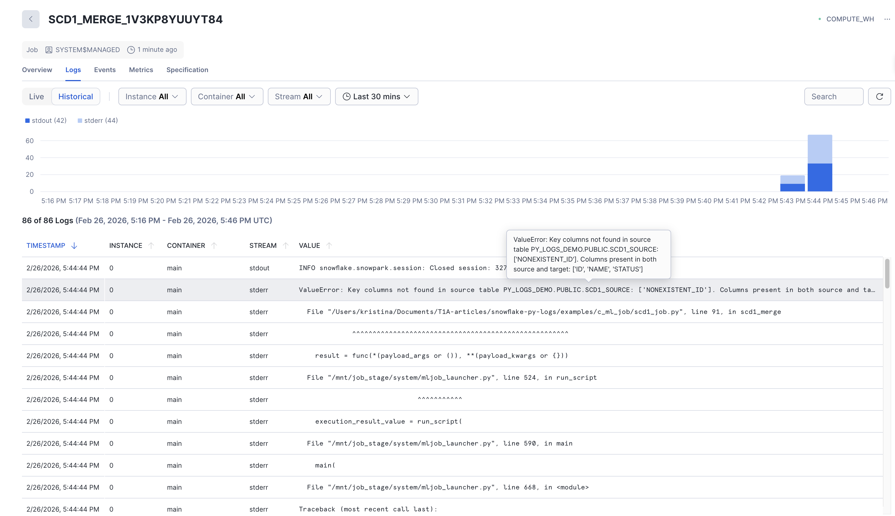

### Summary

**Pros:**
- Best run visibility out of the three options: dedicated Jobs monitoring UI with per-job ID, status, duration, and full console output (live and historical)
- Most convenient for local development
- Pushed-down SQL queries appear in Query History with no extra setup
- Possible to capture structured logs via Python's standard `logging` package even without tracing in event table
- `get_logs()` retrieves all output (`print()`, `logging`, tracebacks) with no event table setup required. Logs are available immediately, no delay like with event table. These live logs also available in Jobs monitoring UI.
- `list_jobs()` and `get_job()` allow querying job run history programmatically. This can also be seen in Jobs monitoring UI.
- Native Python function arguments, no SQL type restrictions

**Cons:**
- Cannot be triggered from SQL, requires the Python SDK or an SQL-triggerable wrapper
- Requires a compute pool, which adds setup overhead compared to warehouse-based options
- Inconvenient for teams that want to keep all development processes inside Snowflake (local development is the easiest way to work with ML Jobs)
- Log capture has minor configuration limitations (global event table used, not all output streams available, etc)


## Comparison

The table below summarizes the key differences between the three options across the functionality covered in this article: how runs are tracked, how logs and errors surface, and how each option is deployed and triggered.

| | Stored Procedures | Notebooks | ML Jobs |
|---|---|---|---|
| **Query History** | Every `CALL` and pushed-down query appears automatically | `EXECUTE NOTEBOOK` and pushed-down queries appear automatically | Pushed-down queries appear automatically; no general trigger entry (submitted via Python SDK) |
| **Custom Logs** | Python `logging`: require tracing to an event table (custom or default); `LOG_LEVEL` set per procedure | Python `logging`: require tracing to an event table (default table only); only works in container runtime; root logger workarounds needed per cell | `print()` and Python `logging`: console output via `get_logs()`; also appears in Job monitoring UI and default event table (but does not require additional tracing set-up). `logging` requires `stream=sys.stdout` to be captured by `get_logs()` after the run is finished |
| **Log Availability** | Event table, with a small delay | Event table, with a small delay | Immediate via `get_logs()` / `show_logs()` and live in Monitoring UI; event table and historical in Monitoring UI with delay |
| **Error Visibility** | SQL errors in Query History; Python errors in event table via catch-log-reraise and in `CALL` query in Query History (error message non-configurable and truncated) | SQL errors in Query History; Python errors in event table and in `EXECUTE NOTEBOOK` query in Query History (error message non-configurable and truncated) | SQL errors in Query History; Python errors in full via `get_logs()` and Monitoring UI |
| **Run History UI** | No dedicated UI; `CALL` querys retrieved from Query History | Notebooks UI run history (owner-scoped, unreliable cell output cache); `EXECUTE NOTEBOOK` querys retrieved from Query History | Dedicated Jobs monitoring UI with per-job ID, status, duration, live and historical logs; programmatically queryable with `list_jobs()` and `get_job()` |
| **Deployment** | Upload `.py` to stage or write inline; `CREATE OR REPLACE PROCEDURE` | Upload `.ipynb` to stage or create from UI / load from git repo; `CREATE NOTEBOOK FROM '@stage'` | `@remote` decorator from local code, or `submit_file()` / `submit_from_stage()`; possible to create job run from UI with additional configuration |
| **SQL Trigger** | `CALL` | `EXECUTE NOTEBOOK` | No direct SQL trigger; requires a wrapper (e.g. a notebook) |
| **Parameter Handling** | Declared in procedure signature; SQL types only | String args to `EXECUTE NOTEBOOK`; declared as text widgets | Native Python function args; any Python type |
| **Compute** | Warehouse | Warehouse (custom logs unavailable) or Compute Pool (with pushdown to Warehouse for SQL) | Compute Pool (with pushdown to Warehouse for SQL) |
| **Interactive Development** | Complicated: redeploy on every change; no syntax highlighting for inline body; native development support in Snowflake | Most simple: cell-by-cell execution, inline errors, UI integration; native development support in Snowflake | Most developer-friendly: convenient local development with standard Python tooling; native development in Snowflake is more limited than local development |

To summarize, there is no single best option: the right choice depends on the overall approach to development in the project and priorities of the specific team. 

In practice, these options are not mutually exclusive. A notebook can be used for development, with the main logic stored in a dedicated Python package called from ML Job for production. The key is to understand what each option gives you in terms of traceability before the team commits to a deployment pattern and define production-level expectations.

**Notebooks** are the easiest way to start: interactive development, inline errors, and quick iteration make them ideal for exploration and prototyping. But once a workload goes to production, the owner-scoped run history and unreliable cell output cache become real limitations.

**Stored procedures** are a good option when the project is already warehouse-bound and only uses simple Python functions while the main logic and sources of error stay in SQL: every `CALL` is in Query History, the workload is triggered via SQL, and no additional compute infrastructure is needed. The trade-off is a less convenient development loop and full reliance on the event table for anything beyond SQL-level tracing. 

**ML Jobs** offer the strongest run visibility: a dedicated monitoring UI, immediate log retrieval, proper local development workflow. But this option is more suitable for Python-first projects and may not fit every team's workflow.

---

All code examples from this article are available in the [snowflake-py-logs-walkthrough](https://github.com/T1A/snowflake-py-logs-walkthrough) repository, in the [`examples/`](https://github.com/T1A/snowflake-py-logs-walkthrough/tree/main/examples) folder. Each subfolder contains a self-contained, runnable implementation of the same SCD1 merge scenario. A shared `justfile` provides commands to deploy, run, and test each option.
